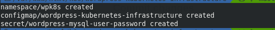
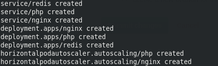
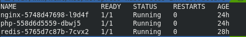
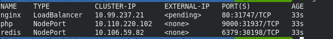
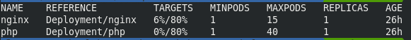

# WordPress on a Kubernetes Structure

## Before you begin

* You need to have a Kubernetes cluster, and the kubectl command-line tool must be configured to communicate with your cluster. 

* You need a MySQL cloud solution configured and accessible.

> This project is not intented for non accustomed users with cloud solutions because we will not abord some techinal aspects, we assume you know configure your cloud and you have a litle knowlogment about kubernetes

## An overview About this project
* Docker images
  * https://hub.docker.com/r/k4izen/nginx
  * https://hub.docker.com/r/k4izen/php
* Configurations files:
  * secret keys are in @kubernetes/keys/secrets-example.yaml
  * kubernetes main yaml are in @kubernetes/wordpress.yaml
  * WordPress are in  @wordpress

>Attention! if you change the namespace from yaml's you will need to change at https://github.com/k4izen/nginx/blob/master/nginx/conf.d/upstream.conf on line 4,8 and at https://github.com/k4izen/wordpress-kubernetes-infrastructure/blob/master/wordpress/config/application.php on line 37

### Steps to mount your own structure based on this project
* rename the file kubernetes/keys/secrets-example.yaml to kubernetes/keys/secrets.yaml and edit it with your variables and site name.

```sh
kubectl create -f kubernetes/keys/secrets.yaml 
```



to check if this part is working you run this commands and see the configuration
```sh
kubectl get configmap  --namespace=wpk8s
kubectl describe configmap  --namespace=wpk8s
kubectl describe configmap wordpress-kubernetes-infrastructure  --namespace=wpk8s
kubectl describe secrets wordpress-mysql-user-password  --namespace=wpk8s
```

* you run the kubernetes/wordpress.yaml now
```sh
kubectl create -f kubernetes/wordpress.yaml
```

```sh
kubectl get pods --namespace=wpk8s
```

```sh
kubectl get svc --namespace=wpk8s
```


```sh
kubectl get hpa --namespace=wpk8s
```


you can scale your pods now manually or automatic thru metrics server

```sh
kubectl scale deploy nginx --replicas=6 --namespace=wpk8s
kubectl scale deploy php --replicas=9 --namespace=wpk8s
```

## About WordPress

roots.io/bedrock/ WordPress boilerplate with modern development tools, easier configuration, and an improved folder structure.

[more info](https://roots.io/bedrock/)

in the kubernetes/wordpress.yaml at line 120 we have commands 
```sh
git clone --single-branch -- https://github.com/k4izen/wordpress-kubernetes-infrastructure.git /PROJECT && 
cd /PROJECT/wordpress &&
composer install --no-interaction --optimize-autoloader --no-dev
```

if you need to change something this is where you can do it.

> Files are not shared between pods so you need to configure some CDN service to keep your uploads safe outside the pod
> To purge redis cache there is a plugin called *Nginx Helper* in this project , active him and go to wp-admin/options-general.php?page=nginx , check the box [x]Enable Purge and radio button (x)Redis cache

## About autoscalling

```
(PHP - service)
minReplicas: 1
maxReplicas: 40
targetCPUUtilizationPercentage: 80

(Nginx - service)
minReplicas: 1
maxReplicas: 15
targetCPUUtilizationPercentage: 80

---

(PHP resource limits)
requests:
 memory: "64Mi"
 cpu: "250m"
limits:
  memory: "128Mi"
  cpu: "500m"
(Nginx resource limits)
requests:
  memory: "30Mi"
  cpu: "15m"
limits:
  memory: "80Mi"
  cpu: "60m"
```

